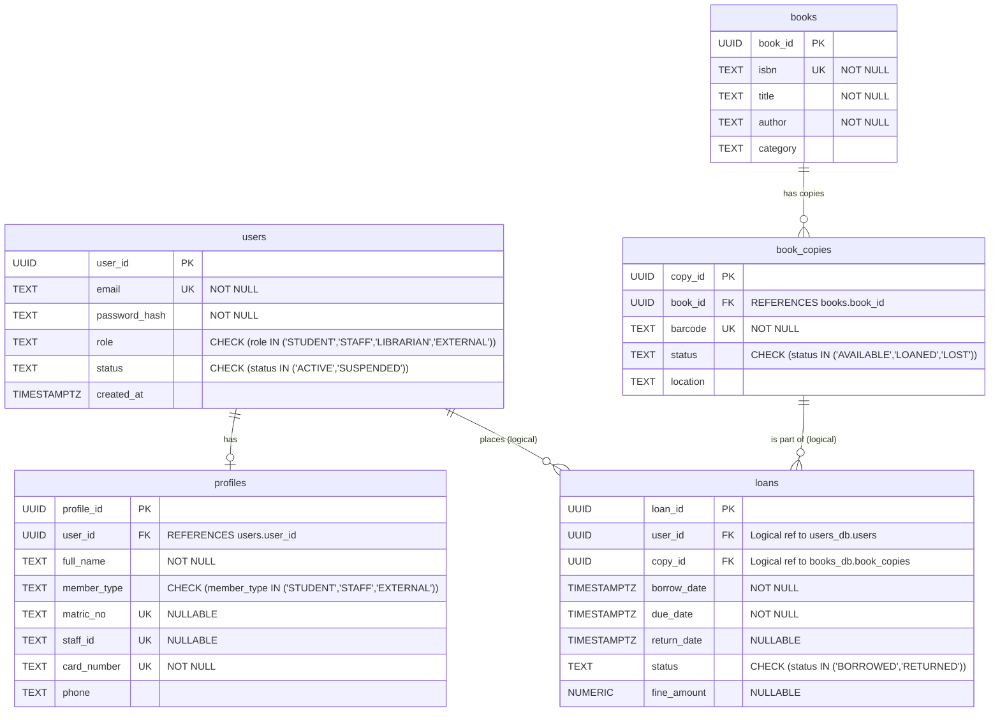
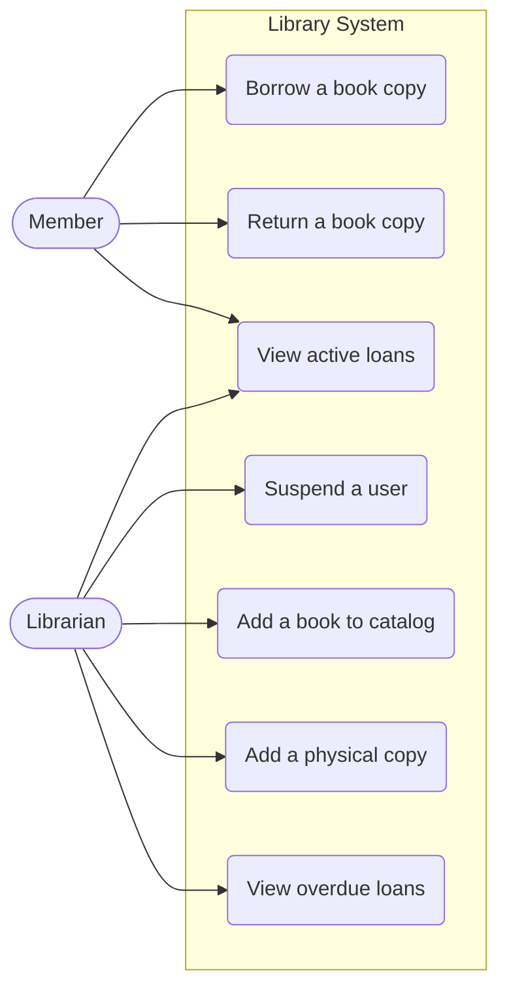
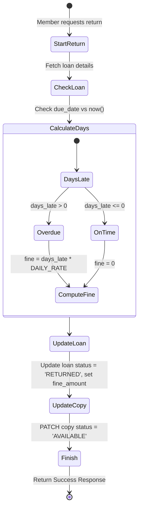
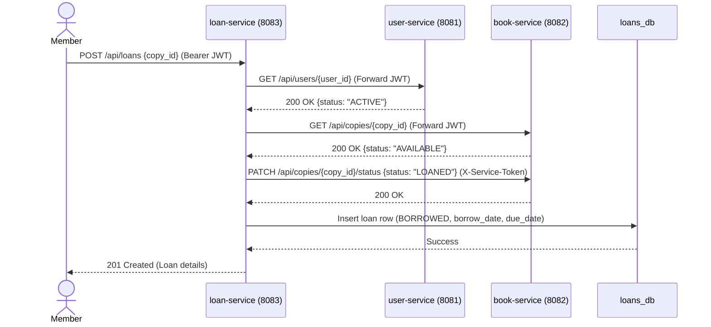
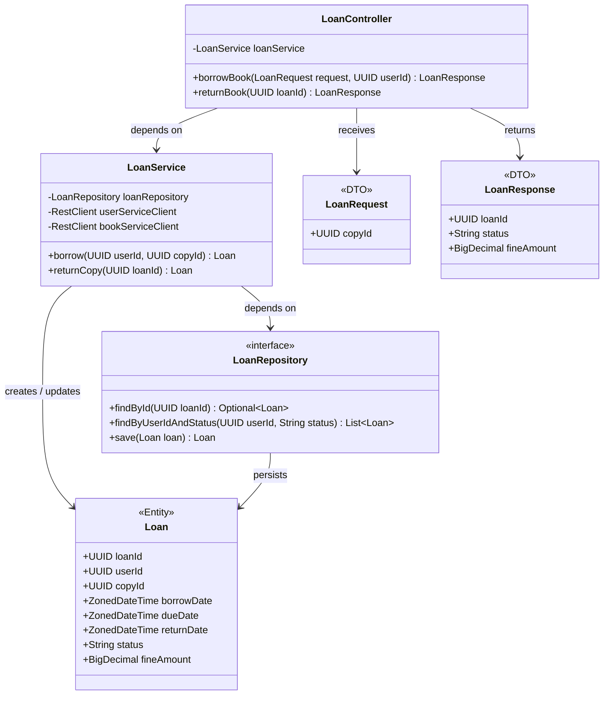

# System UML Models - Automated Library System

This document provides the UML models and diagrams resolving the Phase 1 documentation gaps, adhering to clean architecture principles and focusing on our microservice implementation.

## 1. Entity-Relationship (E-R) Diagram

This diagram reflects the normalized 3NF schema across the three independent microservice databases (`users_db`, `books_db`, `loans_db`). Logical constraints across microservices are shown as logical foreign keys.

## 2. Use Case Diagram

Highlights primary interactions for Members and Librarians.

## 3. Activity Diagram

Details the workflow for returning a book and processing an overdue fine.

## 4. Sequence Diagram

Illustrates the inter-service communication when a Member initiates a book loan.

## 5. Class Diagram (Backend Architecture)

Models the static relationship between Entities, DTOs, and Services within a typical Spring Boot microservice (using `loan-service` as an example) adhering to clean architecture.

